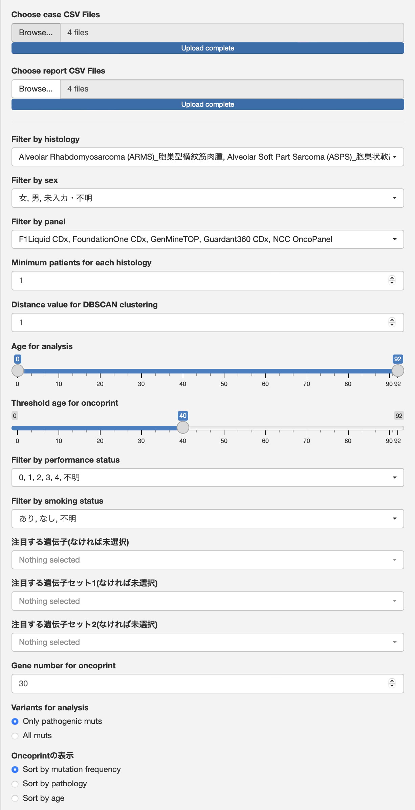

# FELIS for C-CAT database 
Functions Especially for LIquid and Solid tumor clinical sequencing, for Japanese only.

## C-CAT利活用データの解析ソフトウェア
国立がん研究センターに設置されている[がんゲノム情報管理センター(C-CAT)](https://www.ncc.go.jp/jp/c_cat/use/index.html)には保険診療で行われたがん遺伝子パネル検査(Comprehensive Genomic Profiling, CGP検査)の結果と臨床情報が集約されています。この情報を学術研究や医薬品等の開発を目的とした二次利活用する仕組みがあります。現状では所属施設の倫理審査とC-CATでの倫理審査を経た研究でのみ使用可能であり、また病院やアカデミア以外の組織では年間780万円の利用料金が必要と敷居が高いですが、類似した海外のデータベースである[AACR project GENIE](https://www.aacr.org/professionals/research/aacr-project-genie/)と比較して薬剤の情報や臨床情報が詳しい点で優れており、希少がん・希少フラクションの研究においてこれまでになかった切り口での解析が可能になると考えられています。  
  
C-CATのデータを用いるに当たってはビッグデータかつリアルワールドデータの解析には特有の問題があり、また一定程度のデータ処理を行うプログラミングの知識が必要になります。GUIを用いたソフトウェアにより解析の敷居を下げることで、臨床医の日常診療におけるクリニカルクエスチョンに基づいた探索的研究を容易とし、C-CAT利活用データの活用を促進するために本ソフトウェアを作成しました。命名にネコの名前縛りがあるようです。

## 解析手法は以下の論文に基づきます
> 1) Tamura T et al., Selection bias due to delayed comprehensive genomic profiling in Japan, Cancer Sci, 114(3):1015-1025, 2023.  
      左側切断バイアスについては[こちらのwebsite](https://github.com/MANO-B/CCAT)も参照ください。
> 2) Mochizuki T et al., Factors predictive of second-line chemotherapy in soft tissue sarcoma: An analysis of the National Genomic Profiling Database, Cancer Sci, 115(2):575-588, 2024.  

## System Requirements
### Hardware Requirements
数千例の解析であれば問題ありませんが、数万例の解析を行う場合は32GB以上のメモリが必要です。    
生存期間解析はStanを用いたモンテカルロ法でのシミュレーションを行います。4コア以上でできるだけ高速なCPUの使用が望まれます。  
RAM: 4+ GB  
CPU: 4+ cores  
  
3000例、30遺伝子についての生存期間解析を64 GB RAM, M1MAX MacStudioで行った場合、およそ1時間を要します。  

### Software Requirements
#### R language
適宜[ウェブサイト](https://syunsuke.github.io/r_install_guide_for_beginners/03_installation_of_R.html)を参照しRを導入ください。  
特にバージョンの指定はありませんが、本ソフトウェアはv4.3.2を使用して作成しました。  
以下、[コマンドラインからRを起動して作業を行います。](http://kouritsu.biz/installing-r-on-mac/)  
#### Rstan
こちらの[RStan Getting Started (Japanese)](https://github.com/stan-dev/rstan/wiki/RStan-Getting-Started-(Japanese))を参照ください。  
```
# もしすでにrstanをインストールしているならば次の行を実行してください
# remove.packages(c("StanHeaders", "rstan"))

install.packages("rstan", repos = c("https://mc-stan.org/r-packages/", getOption("repos")))
```
#### Shiny
Webアプリとするために[Shiny](https://shiny.posit.co)を使用しました。
```
install.packages("shiny")
```
#### Package dependencies
依存しているパッケージ群を`R`ターミナルからインストールください。  
初めて実行する場合は相当に時間がかかると思われます。  
```
install.packages(c('ggplot2', 'umap', 'tidyr', 'dbscan', 'shinyWidgets', 'readr', 'dplyr', 'stringr', 'RColorBrewer', 'gt', 'gtsummary', 'flextable', 'Rediscover', 'survival', 'gridExtra', 'survminer', 'tranSurv', 'DT', 'ggsci', 'scales', 'patchwork', 'sjPlot', 'sjlabelled', 'forcats', 'BiocManager'), dependencies = TRUE)
BiocManager::install(c("ComplexHeatmap"), update=FALSE)
```

## FELISの起動と解析ファイルの読み込み
- 解析ファイルの入手
まずは解析したい症例の情報をC-CAT利活用検索ポータルからダウンロードします。
症例を選択した上で、以下の画像の通り  
・レポートCSV（全データ出力）  
・症例CSV（全データ出力）  
の2つのファイルをダウンロードします。ZIPファイルは解凍してCSVファイルに戻して使用します。  
　　

- FELISのダウンロード
使用するバージョンのFELISのZIPファイルをダウンロードし、適当なフォルダにダウンロード・解凍してください。  
ここでは"/User/C-CAT/Desktop/felis-cs"とします。  

- FELISの起動
以下のコマンドでWebアプリが起動します。  
```
$ R

R version 4.3.2 (2023-10-31) -- "Eye Holes"
Copyright (C) 2023 The R Foundation for Statistical Computing
Platform: aarch64-apple-darwin20 (64-bit)
.
.
.
'help.start()' で HTML ブラウザによるヘルプがみられます。 
'q()' と入力すれば R を終了します。

> library(shiny)
> runApp('/User/C-CAT/Desktop/felis-cs')
```


- ファイルの読み込み
ダウンロードした症例CSVとレポートCSVを、画面左上のBrowse...ボタンから選択して読み込みます。  
複数のファイルを読み込むことも可能です。

## 解析対象の指定  
多数の項目が設定可能です。  
  

- Filter by histology  
　　解析対象とする組織型の絞り込みを行います。  
- まとめて解析する組織型(なければ未選択)  
　　一つの組織型として扱って解析したい組織型群を選択します。  
- まとめて解析する組織型1の名前  
　　まとめて解析したい組織型を代表する名前を選択します。  
- Filter by sex  
　　解析対象とする性別の絞り込みを行います。  
- Filter by panel  
　　解析対象とするがん遺伝子パネル検査の絞り込みを行います。  
- Minimum patients for each histology  
　　稀な組織型は発生部位に名前を変更して解析できます。  
　　解析する組織型の最小症例数を設定します。  
- Distance value for DBSCAN clustering  
　　クラスタリング解析において弁別する距離の閾値を設定します。  
- Age for analysis  
　　解析対象とする年齢の絞り込みを行います。  
- Threshold age for oncoprint  
　　OncoprintでのYoung/Oldの分類の閾値を設定します。  
- Filter by performance status  
　　解析対象とするPSの絞り込みを行います。  
- Filter by smoking status  
　　解析対象とする喫煙歴の絞り込みを行います。  
- 注目する遺伝子(なければ未選択)  
　　Oncoprintや生存期間解析等で優先する遺伝子を選択します。  
- 注目する遺伝子セット1(なければ未選択)  
　　とくに注目する遺伝子セットがあれば選択します。  
- Gene number for oncoprint  
　　Oncoprintや生存期間解析で対象とする遺伝子の絞り込みを行います。  
　　特に生存期間解析にかかる時間に影響が出ます。  
- Variants for analysis  
　　がん化変異のみ解析するか、病的意義に関わらず全ての変異を解析するか選択します。  
- Oncoprintの表示  
　　Oncoprintにおけるソートの順序を設定します。  
   
## 解析の実行  
多数の解析が可能です。  
  

- 症例のまとめを表示  
　　選択した症例のまとめを__Patients summary__タブに表示します。  
- Oncoprintを表示  
　　選択した症例の遺伝子変異を__Oncoprint__タブに表示します。  
　　症例の表を__Per_patient_table__タブに表示します。  
- 相互排他・共変異を表示  
　　[Rediscover package]()を用いた遺伝子変異感の相互排他性解析結果を__Co-occurrence__タブに表示します。  
- Filter by histology  
　　解析対象とする組織型の絞り込みを行います。  
- Filter by histology  
　　解析対象とする組織型の絞り込みを行います。  
- Filter by histology  
　　解析対象とする組織型の絞り込みを行います。  


# Version history
1.0.0: C-CAT database version 20240621に対応  
