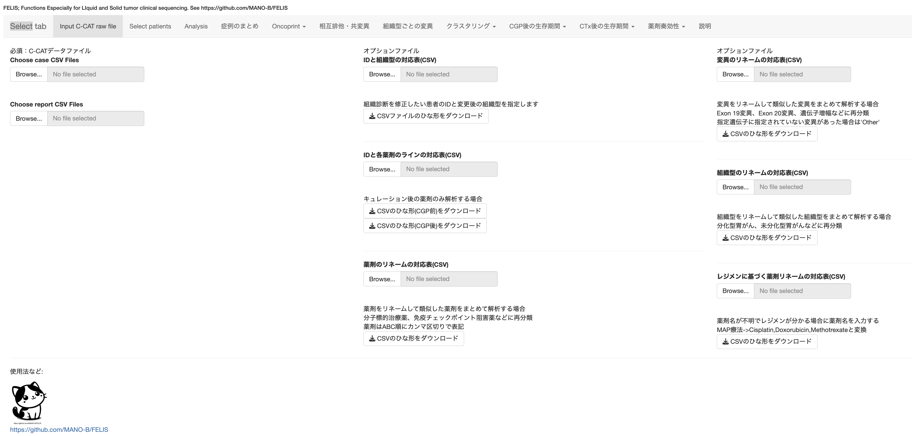

## FELIS for C-CAT database 

FELIS (Flexible Exploration for LIquid and Solid tumor clinical sequencing data) for the C-CAT database.  
[日本語の説明はこちら](README_JPN.md).  
[日本語のスライドその1はこちら](https://www.felis-portal.com/slide/多地点合同メディカルカンファ20241010.pptx).  
[日本語のスライドその2はこちら](https://www.felis-portal.com/slide/臨床疫学会2026_CGP到達予測.pptx).  
[日本語のスライドその3はこちら](https://www.felis-portal.com/slide/整形外科学会基礎学術集会2025-2.pptx).  

Copyright (c) 2024 Masachika Ikegami, Released under the [MIT license](https://opensource.org/license/mit).  

### Practical usage guide and tips
You may find it easier to get started by referring to: [Tips.md](Tips.md)

### Trial Website
You can test v4.2.3 with dummy data on [this server](https://www.felis-portal.com/felis-ccat/).  
You can test v4.2.3 with actual C-CAT data on [this server](https://www.felis-portal.com/felis-cs/).  
After trying it out, please run analyses on your local environment following the procedure described below.

Basically, please execute it in a local environment according to the procedure described below.  

### Web application for analyzing secondary-use C-CAT data
At the National Cancer Center Japan, the [Center for Cancer Genomics and Advanced Therapeutics (C-CAT)](https://www.ncc.go.jp/jp/c_cat/use/index.html) aggregates results of cancer gene panel testing performed as part of insured clinical practice (Comprehensive Genomic Profiling; CGP testing) along with clinical information. A framework exists for secondary use of these data for academic research and pharmaceutical development.

At present, the data can only be used for studies that have passed ethics review at the user’s institution and at C-CAT. In addition, organizations outside hospitals/academia are required to pay an annual usage fee of 7.8 million JPY, which makes the barrier to entry high. However, compared with a similar overseas database, [AACR Project GENIE](https://www.aacr.org/professionals/research/aacr-project-genie/), C-CAT is advantageous in that it contains more detailed information on drugs and clinical data. It is therefore expected to enable novel analyses, particularly for rare cancers and rare molecular fractions.

Analyzing C-CAT data involves challenges specific to big data and real-world data, and requires some programming knowledge to perform data processing. We developed this software to lower the barrier to analysis by providing a GUI-based tool, thereby facilitating exploratory research based on clinicians’ day-to-day clinical questions and promoting broader utilization of secondary-use C-CAT data. “Felis” is the scientific name for cats, and it seems that C-CAT-related projects often adopt cat-themed naming conventions.

Please understand that currently this software can only be used by those who are able to obtain data from C-CAT.  
If you are unsure how to use it, please contact: maikegam [at] ncc.go.jp

### The analytical methods are based on the following papers
> 1) Tamura T et al., Selection bias due to delayed comprehensive genomic profiling in Japan, Cancer Sci, 114(3):1015-1025, 2023.  
      For left-truncation bias, please also refer to [this website](https://github.com/MANO-B/CCAT).
> 2) Mochizuki T et al., Factors predictive of second-line chemotherapy in soft tissue sarcoma: An analysis of the National Genomic Profiling Database, Cancer Sci, 115(2):575-588, 2024.

### System Requirements

#### Hardware Requirements
Minimum requirement  
RAM: 4+ GB  
CPU: 4+ cores  
  
Analyses of several thousand cases should be fine, but analyses of tens of thousands of cases require at least 8 GB of memory.  
For survival analyses, Monte Carlo simulation is performed using Stan. A CPU with 4 or more cores, and as fast as possible, is recommended.  

On a Mac Studio (M4 Max, 128 GB RAM), the initial ingestion and preprocessing of ~110,000 cases and 20 genes takes ~1 hour; after preprocessing, loading the saved dataset typically takes ~20 seconds.

#### Software Requirements

## Docker (recommended)
If you can use Docker, you can start using FELIS immediately without complicated installation steps.  
For how to use Docker, please refer to guides for [Windows](https://qiita.com/hoshimado/items/51c99ccaee3d4222d99d) or [macOS](https://www.kagoya.jp/howto/cloud/container/dockerformac/).  
When using Docker Desktop, please set CPU to 4+ cores and memory as large as possible (see [this tip](https://dojo.docker.jp/t/topic/52)).  
FELIS Docker images are available on [Docker Hub](https://hub.docker.com/r/ikegamitky/).  

```bash
# Start Docker Desktop in advance.
# On Windows: use Command Prompt. On macOS: use Terminal.
# Use sudo where appropriate.
# Run the same command when upgrading.
docker pull ikegamitky/felis:latest

# If an old container keeps running, stop and remove it as follows:
docker ps -a
docker kill [container id]
docker rm [container id]
```

To run FELIS, execute the following command and then access **http://localhost:3838** in your browser.
```bash
docker run -it --rm -p 3838:3838 ikegamitky/felis:latest R
```
  
Run the following line in R to start FELIS:
```r
Sys.setenv(FELIS_DATA_ROOT = "/srv/shiny-server/felis-cs")
# Sys.setenv(FELIS_DATA_ROOT = "/srv/shiny-server/felis-ccat") # with dummy data
APP_DIR <- system.file("app", package = "FELIS")
setwd(APP_DIR)
source("app.R", local = TRUE, chdir = TRUE)
# Run the application
shinyApp(ui = ui, server = server)
```

When launching FELIS on a server, after entering the following command from the terminal, you no longer need to keep the SSH session open.  
If the server IP address is 172.25.100.1, access **http://172.25.100.1:3838/felis-cs**, or **http://172.25.100.1:3838/felis-ccat** with dummy data in your browser.

```bash
# ssh username@servername
docker run -d -p 3838:3838 ikegamitky/felis:latest nohup shiny-server
# exit
```

If you use the docker image, you can skip ahead to the **Loading analysis files** section.

# Local install
##### R language
Please install R by referring to an appropriate guide (e.g., [this website](https://syunsuke.github.io/r_install_guide_for_beginners/03_installation_of_R.html)).  
No specific version is required, but this software was developed using R v4.3.2.  
Below, we will work by launching R from the command line (see: [example guide](http://kouritsu.biz/installing-r-on-mac/)).

##### Rstan
Please refer to [RStan Getting Started (Japanese)](https://github.com/stan-dev/rstan/wiki/RStan-Getting-Started-(Japanese)).  

- For macOS installation, [Xcode CLT](https://qiita.com/payreikit/items/4bb0f863afc7b56d0809) is required, and because you will install [macrtools](https://mac.thecoatlessprofessor.com/macrtools/) from [GitHub](https://github.com), you will need a GitHub account. See also [this page](https://qiita.com/tsutsumin_pro/items/52a483d67c9b9e490d76).  
- For Windows, install [Rtools](https://github.com/stan-dev/rstan/wiki/Configuring-C---Toolchain-for-Windows) matching your R version.  
- For Linux, follow the instructions [as appropriate](https://github.com/stan-dev/rstan/wiki/Configuring-C-Toolchain-for-Linux).

### For macOS
#### Install Command Line Tools for Xcode:
```bash
xcode-select --install
```

#### In Terminal, install Homebrew, libomp:
```bash
/bin/bash -c "$(curl -fsSL https://raw.githubusercontent.com/Homebrew/install/HEAD/install.sh)"
brew install libomp
export PKG_LIBS="-fopenmp"
export PKG_CPPFLAGS="-I/usr/local/opt/libomp/include -Xpreprocessor -fopenmp"
```

#### In the R console, run:
```r
install.packages("remotes")
remotes::install_github("coatless-mac/macrtools")
options(timeout=1000)
macrtools::macos_rtools_install()
dotR <- file.path(Sys.getenv("HOME"), ".R")
if (!file.exists(dotR)) dir.create(dotR)
M <- file.path(dotR, "Makevars")
if (!file.exists(M)) file.create(M)
arch <- ifelse(R.version$arch == "aarch64", "arm64", "x86_64")
cat(paste("\nCXX17FLAGS += -O3 -mtune=native -arch", arch, "-ftemplate-depth-256"),
    file = M, sep = "\n", append = FALSE)
install.packages("rstan", repos = c("https://mc-stan.org/r-packages/", getOption("repos")))
```

### For Windows
#### Install Rtools:
https://k-metrics.github.io/cabinet/env_install_tls.html  
https://cran.r-project.org/bin/windows/Rtools/  
  
#### Install Visual Studio
#### During installation, be sure to select the workload: **Desktop development with C++**
https://visualstudio.microsoft.com/ja/vs/community/  
  
#### In the R console, run:
```r
install.packages("rstan", repos = c("https://mc-stan.org/r-packages/", getOption("repos")))
```

### For Linux
#### For Ubuntu/Debian:
```bash
sudo apt-get install -y build-essential cmake git
```

#### For CentOS/RHEL:
```bash
sudo yum install -y gcc-c++ cmake git
```

##### In the R console, run:
```r
install.packages("rstan", repos = c("https://mc-stan.org/r-packages/", getOption("repos")))
```

##### Shiny
We use [Shiny](https://shiny.posit.co) to build the web application.

##### Package dependencies
Please install dependent packages from the `R` console/terminal.  
Because installing all required system libraries via apt/brew etc. can be burdensome, using Docker is strongly recommended.

```r
install.packages(c(
  # Shiny / UI
  "shiny","shinyBS","shinyjqui","shinyWidgets","shinydashboard","DT","shinythemes","markdown",

  # Data handling / plotting
  "dplyr","tidyr","readr","stringr","forcats","data.table",
  "ggplot2","scales","RColorBrewer","ggsci","ggrepel","patchwork","gridExtra","ggiraph",
  "Rediscover",

  # Tables / reporting
  "gt","gtsummary","flextable",

  # Survival / stats
  "survival","survminer","survRM2","flexsurv","rms","PropCIs","pROC",
  "Matching","dcurves","MatchIt","cobalt","tranSurv",

  # ML core (tidymodels meta)
  "tidymodels","tidybayes",

  # ML extras / models (tidymodels ecosystem)
  "mltools","bonsai","discrim","klaR","probably","ranger","lightgbm","partykit","rpart","bigstep","twang",

  # Dimension reduction / clustering
  "umap","dbscan",

  # misc
  "httr","plyr","withr","blorr","betacal",
  "sjPlot","sjlabelled","aws.s3",

  # install helpers
  "BiocManager","RcppParallel","remotes"
), dependencies = TRUE)

BiocManager::install(c("maftools","ComplexHeatmap","drawProteins"), update = FALSE)

install.packages("cmdstanr", repos = c("https://mc-stan.org/r-packages/", getOption("repos")))
cmdstanr::install_cmdstan()

# Windows user
install.packages("qs2")

# On x64 Mac or Linux, you can enable multi-threading by compiling from source.
# It is enabled by default on Windows.
remotes::install_cran("qs2", type = "source", configure.args = "--with-TBB --with-simd=AVX2")

# On non-x64 systems (e.g., Mac ARM), remove the AVX2 flag.
remotes::install_cran("qs2", type = "source", configure.args = "--with-TBB")


# If installation of drawProteins fails:
remotes::install_github('brennanpincardiff/drawProteins')

# If installation of rms fails due to your R version:
# Check the appropriate version here and change as needed:
# https://cran.r-project.org/src/contrib/Archive/rms/
remotes::install_version(package = "rms", version = "6.7.0", dependencies = FALSE)
```
## Launching FELIS
 
- Starting FELIS  
```r
remotes::install_github('MANO-B/FELIS')
Sys.setenv(FELIS_DATA_ROOT = getwd())
APP_DIR <- system.file("app", package = "FELIS")
setwd(APP_DIR)
source("app.R", local = TRUE, chdir = TRUE)
# Run the application
shinyApp(ui = ui, server = server)
```

  

### Loading analysis files

- Obtaining analysis files  
First, download the information for the cases you wish to analyze from the C-CAT secondary-use search portal.  
Set the portal language to Japanese (not English), select cases, and download the following two files as shown in the screenshots below:

- Report CSV (full data output)  
- Case CSV (full data output)

The ZIP files can be used without extracting.  
Dummy data for testing can also be downloaded.

　　

Open the **Input C-CAT files** tab.  
Select and load the downloaded Case CSV and Report CSV from the **Browse...** buttons at the top-left of the screen.  
You can also load multiple files at once.  
Optionally, you can provide mapping tables to rename drugs and histology categories.

### Specifying the analysis cohort

Open the **Setting** tab.  
Click **Start file loading/analysis settings** to display configuration options.  
Many settings are available.

  

#### Filters related to histology
- Filter by histology  
    Narrow down the histologic types to be analyzed.  
- Histology type to be analyzed  
    Select a group of histologies that you want to treat as a single histologic category for analysis (leave unselected if not needed).  
- Name for histology type  
    Specify a representative name for the merged histology category.  
- Minimum patients for each histology  
    Rare histologies can be analyzed by renaming them to the primary site name.  
    Set the minimum number of patients per histology to keep as-is.

#### Filters related to clinical variables
- Filter by sex  
    Filter by sex.  
- Filter by panel  
    Filter by the CGP panel.  
- Age for analysis  
    Filter by age.  
- Threshold age for oncoprint  
    Set the threshold for the Young/Old classification in Oncoprint.  
- Filter by performance status  
    Filter by PS.  
- Filter by smoking status  
    Filter by smoking history.  
- Filter by test-year  
    Filter by the year in which CGP testing was performed.

#### Filters related to genes
- Genes of interest (if any)  
    Select genes to prioritize in Oncoprint and survival analyses.  
- Gene-set of interest (if any)  
    Select a gene set of special interest, if applicable.  
- Case selection based on the mutations  
    You can restrict the cohort to only cases with (or without) specific mutations.  
- Genes for lolliplot (if any)  
    Select genes of interest. Internet access is required for full rendering.  
    If there is no Internet access, a simplified view will be used.  
    This feature uses scripts from [Mutplot](https://github.com/VivianBailey/Mutplot).  
- Threshold mutation count for lolliplot  
    A setting to highlight frequent mutations.

#### Filters related to variant types
- Gene to analyze (if any)  
    Select a gene for which you want to examine detailed mutation sites/patterns.  
    Example: EGFR TKD mutations  
- Variants  
    Select variants to be grouped and analyzed as a single mutation pattern.  
- Name for variants  
    Name the mutation pattern.  
- Pathological significance of the genes  
    You can change the pathological significance categories only for this gene.  
- Treat specified variants independently?  
    You can treat specified variants as if they were a single “gene.”  
    Example: rename EGFR TKD mutations to EGFR_TKD.

#### Other settings
- Gene number for oncoprint  
    Limit the number of genes shown in Oncoprint and survival analyses.  
    This affects computation time, especially for survival analyses.  
- Display order of Oncoprint  
    Configure the sorting order in Oncoprint.  
- Variants for analysis  
    Choose whether to analyze only oncogenic variants or all variants regardless of clinical significance.  
- How to analyze fusion genes  
    When there are many partner genes, each partner may have only a small number of cases.  
    Choose whether to group fusion genes (e.g., NTRK fusion, ALK fusion) for analysis.  
- Distance value for DBSCAN clustering  
    Set the distance threshold used in clustering.  
- Timing for RMST measuring  
    Specify the time point for Restricted Mean Survival Time (RMST) analysis.  
- CTx lines to analyze  
    Specify the lines of therapy to analyze.  
    If you select only 1st-line, comparisons with prior therapy will not be performed.

### Running analyses

Open the **Analysis** tab.  
Many analyses are available. Explanatory text appears at the bottom as needed.  
Results are shown in the tabs corresponding to each button.  
Displayed figures can be saved as `.png`.

   

#### Show cohort summary
Show a summary of selected cases in the **Case summary** tab.
- Summarized by mutation pattern → shown in **Summarized by mutation pattern**.  
- Summarized by histology → shown in **Summarized by histology**.

#### Compare mutation counts between panels
- Show the distribution of VAF by panel in **Comparison figure**.  
- Show a table summarizing TMB and mutation counts by histology and panel in **Comparison figure**.

#### Display Oncoprint
- Display genetic alterations for selected cases in **Oncoprint**.  
- Display a lollipop plot for the selected gene in **Lolliplot for the selected gene** (Internet required).  
  If it does not display correctly, add the appropriate [UniProt ID](https://www.uniprot.org) to `source/UniProt.txt`.  
- Display a patient-level table in **Table of clinical and mutation information per patient**. You can download it from the button at the top-left.

#### Show mutual exclusivity / co-occurrence
- Display results of mutual exclusivity analysis of gene mutations using the [Rediscover package](https://academic.oup.com/bioinformatics/article/38/3/844/6401995) in **Mutual exclusivity**.  
  Blue indicates mutual exclusivity; red indicates co-occurrence.  
  An asterisk is shown when P < 0.001.

#### Display mutation frequencies by histology
- For frequently mutated genes, display mutation frequencies by histology in **Variation by histology**.

#### Clustering based on gene mutations
Perform clustering based on mutated genes using [UMAP](https://arxiv.org/abs/1802.03426) and [DBSCAN](https://cdn.aaai.org/KDD/1996/KDD96-037.pdf).  
Results are displayed under the **Clustering analysis** tab.

- Display basic information for each histology in **Basic data**:  
    - Driver: proportion of cases with at least one oncogenic mutation  
    - option / treat: proportion (%) with recommended therapy by the expert panel / proportion (%) who received therapy  
    - time_before_CGP: median survival (days) from start of palliative chemotherapy to CGP test  
    - time_after_CGP: median survival (days) from CGP test to death  
- Display histologies and gene mutations enriched in each cluster in **UMAP clustering based on mutations**:  
    - Up to the top 3 histologies enriched at P < 0.05 are shown, ordered by higher odds ratio compared with other clusters.  
    - Up to the top 3 gene mutations enriched at P < 0.05 are shown, ordered by higher odds ratio compared with other clusters.  
- Display the age distribution by cluster in **Cluster and age relationship**.  
- Display the histology distribution by cluster in **Cluster and histology relationship**.  
- Display whether each histology concentrates into a small number of clusters or spreads across many clusters as entropy in **Heterogeneity within histologic types**.  
    Shannon entropy is used; a lower value indicates stronger concentration.  
- Display the table of relationships between clusters and histologies in **Table of clusters and histologies** (downloadable).  
- Display the table of relationships between clusters and gene mutations in **Table of clusters and genetic variants** (downloadable).  
- Display the frequency of cases with mutations corresponding to drugs with evidence levels (within each histology) in **Frequency of patients with targeted therapy**.  
    Evidence levels are harmonized to the highest level: if both level A and level B drugs exist, the patient is counted as level A.  
- Display the relationship between mean survival time from start of chemotherapy to CGP testing and from CGP testing to death for each histology in **Relationship between pre-CGP and post-CGP periods**.  
- Display the relationship between the number of cases and treatment information for each histology in **Patients per histology and treatment reach rate**:  
    Scatter plots are created for:  
    - number of patients vs. proportion with evidence level A/B-or-higher/C-or-higher drugs  
    - number of patients vs. proportion with recommended therapy / proportion receiving recommended therapy / proportion receiving therapy among those with recommended therapy  
- Display the relationship between time to CGP testing and treatment information for each histology in **Pre-CGP period and treatment reach rate**.  
- Display the relationship between post-CGP survival and treatment information for each histology in **Post-CGP period and treatment reach rate**.  
- Display the relationship between mean age and treatment information for each histology in **Age and treatment reach rate**.

#### Survival analysis after CGP
Perform survival analysis after CGP focusing on gene mutations, treatments, PS, etc.  
95% confidence intervals are calculated using a log-log transformation.  
This may help identify patients with poor prognosis for whom earlier CGP testing could be beneficial.

Results are displayed under the **Survival after CGP** tab.

- Survival analyses stratified by presence/absence of recommended therapy and treatment content are shown in **Survival and treatment after CGP**:  
    - UnrecomTreat(+): patients who received treatments other than recommended therapy  
    - RecomTreat(+): patients who received recommended therapy  
    - Treat(-): patients who did not receive treatment after CGP  
- Survival analyses stratified by histology, PS, and mutation status are shown in **Survival after CGP and performance status**.  
- Survival analyses stratified by best overall response and number of treatment courses are shown in **Survival after CGP and previous treatment**.  
    For mutation analysis, if genes of interest are specified, stratification is performed by whether any of those genes are mutated.  
- Median survival (days) stratified by mutation status is shown in **Survival after CGP and mutations, forest plot**.  
    When mutation frequency is low, 95% CIs may not be displayed.  
- Kaplan–Meier curves stratified by mutation status are shown in **Survival after CGP and mutations, KM-curve**.  
- Forest plots of hazard ratios for death after CGP are shown in **Hazard ratio for survival after CGP**.  
    Factors with ≥95% agreement are regarded as multicollinearity and excluded.  
    Factors with ≤2 death events are not displayed.  
- A nomogram predicting whether a patient will receive recommended therapy is shown in **Factors leading to Treatment, pre-CGP, Nomogram**.  
- A nomogram predicting whether a patient **with recommended therapy available** will receive that recommended therapy is shown in **Factors leading to Treatment, post-CGP, Nomogram**.  
- Odds ratios for factors associated with receiving recommended therapy are shown in **Factors leading to Treatment, pre-CGP, Odds ratio**.  
- Odds ratios for factors associated with receiving recommended therapy among patients **with recommended therapy available** are shown in **Factors leading to Treatment, post-CGP, Odds ratio**.  
- Performance of the nomogram is evaluated using [Decision curve analysis](https://mskcc-epi-bio.github.io/decisioncurveanalysis/index.html) and shown in **Factors leading to Treatment, decision curve**.  
  For how to interpret the results, see [decision_curve_analysis.md](https://github.com/MANO-B/FELIS/blob/main/decision_curve_analysis.md).  
- Details of decision curve analysis are shown in **Factors leading to Treatment, table**.

#### Survival analysis after initiation of chemotherapy (time-consuming)
Perform survival analysis after initiation of palliative chemotherapy accounting for left-truncation bias.  
Because Stan-based simulation is used, the analysis can take on the order of tens of minutes.

Results are displayed under the **Survival after CTx** tab.

- Survival analyses corrected for left-truncation bias using three approaches (bias correction, number-at-risk correction, simulation correction) are shown in **Survival corrected for left-truncation bias**.  
- Survival analyses stratified by mutation status of genes of interest are shown in **Survival corrected for left-truncation bias**.  
    If genes of interest are specified, stratification is based on whether any of those genes are mutated.  
    If no genes are specified, stratification is based on the most frequently mutated gene.  
- Differences in median survival (days) by mutation status are shown in **Genetic variants and survival, forest plot**.  
    Results may not be displayed when the number of death events is small.  
- Survival curves stratified by mutation status are shown in **Genetic variants and survival, KM-curve**.

#### List of regimens used for palliative chemotherapy (1st–4th line)
Extract regimens used for 1st–4th line palliative chemotherapy and display them within the **Analysis** tab.  
Select drugs of interest for subsequent analyses.  
Because inputs may be inaccurate, it is recommended to use this mainly to examine general trends.

#### Response analysis for the drugs selected above
Evaluate associations between treatment response duration and gene mutations / histology by focusing on Time on Treatment (ToT).  
Results are displayed under the **Drug response** tab.

- Summarize all drugs by line of treatment in **Drug use, by line of treatment**.  
- Summarize all drugs by treatment effect in **Drug use, by treatment effect**.  
- Summarize drugs for the specified line by mutation pattern in **Use of designated line agents, by mutation pattern**.  
- Summarize drugs for the specified line by histology in **Use of designated line agents, by histology**.  
- Summarize drugs for the specified line by mutated genes in **Use of designated line agents, by mutated genes**.  
- Summarize drugs (specified line / specified drugs) with ToT information by mutation pattern in **Use of designated lines and drugs with ToT information, by mutation pattern**.  
- Summarize drugs (specified line / specified drugs) with ToT information by histology in **Use of designated lines and drugs with ToT information, by histology**.  
- Summarize drugs (specified line / specified drugs) with ToT information by mutated genes in **Use of designated lines and drugs with ToT information, by mutated genes**.  
- Summarize drugs (specified line / specified drugs) with RECIST information by mutation pattern in **Use of designated lines and drugs with RECIST information, by mutation pattern**.  
- Summarize drugs (specified line / specified drugs) with RECIST information by histology in **Use of designated lines and drugs with RECIST information, by histology**.  
- Summarize drugs (specified line / specified drugs) with RECIST information by mutated genes in **Use of designated lines and drugs with RECIST information, by mutated genes**.  
- Display waterfall plots and scatter plots for the relationship between ToT for the drug of interest and ToT for prior therapies in **Time on treatment and pre-treatment for the specified treatment, scatter plot**.  
    Censored cases are excluded.  
- Display KM curves comparing ToT across prior therapies and other drugs, and the relationship between mutations and ToT, in **Time on treatment and pre-treatment for the specified treatment, KM-curve**.  
- Display KM curves of ToT by histology for the drug of interest in **Time on treatment by tissue type, KM-curve**.  
- Display KM curves of ToT by gene-mutation clusters for the drug of interest in **Time on treatment by gene mutation cluster, KM-curve**.  
- Display forest plots of median OS for ToT by mutation status in **Time on treatment by mutated genes, forest plot**.  
- Display KM curves of ToT by mutation status in **Time on treatment by mutated genes, KM-curve**.  
- Display KM curves for relationships among ToT, genes of interest, and mutation patterns of interest in **Time on treatment and mutations of interest, KM-curve**.  
- Display tables of hazard ratios for factors leading to treatment discontinuation in **Hazard ratio on time on treatment**.  
- Display tables of odds ratios for factors associated with objective response in **Odds ratio on objective response rate**.  
- Display tables of odds ratios for factors associated with disease control in **Odds ratio on disease control rate**.  
- Display response tables by gene-mutation cluster in **Mutation clustering and RECIST**.  
    95% confidence intervals are calculated using the Clopper–Pearson method.  
- Display response tables by mutation pattern in **Mutation pattern and RECIST**.  
- Display response tables by histology in **Histology and RECIST**.  
- Display response tables by mutated genes in **Mutated genes and RECIST**.  
- Draw survival curves after CGP for each drug used after CGP in **Survival and drug**.

#### Instruction
Display descriptions such as how to use the software in the **Instruction** tab.

### Recommended FELIS version by C-CAT database version
Because column names in C-CAT data may be added/changed depending on the database version, you need a compatible FELIS version.  
C-CAT database version 20240621 ~ 20251231: FELIS version 4.2.5
