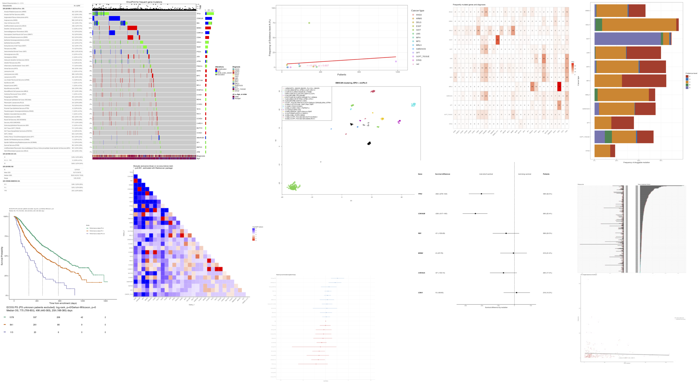

## FELIS for C-CAT database 
Functions Especially for LIquid and Solid tumor clinical sequencing for C-CAT database.  
[English version of this README file](https://github.com/MANO-B/FELIS/blob/main/README_ENG.md).  
Copyright (c) 2024 Masachika Ikegami, Released under the [MIT license](https://opensource.org/license/mit).  

### C-CAT利活用データの解析Webアプリ
国立がん研究センターに設置されている[がんゲノム情報管理センター(C-CAT)](https://www.ncc.go.jp/jp/c_cat/use/index.html)には保険診療で行われたがん遺伝子パネル検査(Comprehensive Genomic Profiling, CGP検査)の結果と臨床情報が集約されています。この情報を学術研究や医薬品等の開発を目的とした二次利活用する仕組みがあります。現状では所属施設の倫理審査とC-CATでの倫理審査を経た研究でのみ使用可能であり、また病院やアカデミア以外の組織では年間780万円の利用料金が必要と敷居が高いですが、類似した海外のデータベースである[AACR project GENIE](https://www.aacr.org/professionals/research/aacr-project-genie/)と比較して薬剤の情報や臨床情報が詳しい点で優れており、希少がん・希少フラクションの研究においてこれまでになかった切り口での解析が可能になると考えられています。  
  
C-CATのデータを用いるに当たってはビッグデータかつリアルワールドデータの解析には特有の問題があり、また一定程度のデータ処理を行うプログラミングの知識が必要になります。GUIを用いたソフトウェアにより解析の敷居を下げることで、臨床医の日常診療におけるクリニカルクエスチョンに基づいた探索的研究を容易とし、C-CAT利活用データの活用を促進するために本ソフトウェアを作成しました。Felisはネコの学名であり、C-CAT関連の命名にはネコの名前縛りがあるようです。

C-CATからデータを入手可能な方のみが本ソフトウェアを使用可能となる現状はご理解ください。  

### 解析手法は以下の論文に基づきます
> 1) Tamura T et al., Selection bias due to delayed comprehensive genomic profiling in Japan, Cancer Sci, 114(3):1015-1025, 2023.  
      左側切断バイアスについては[こちらのwebsite](https://github.com/MANO-B/CCAT)も参照ください。
> 2) Mochizuki T et al., Factors predictive of second-line chemotherapy in soft tissue sarcoma: An analysis of the National Genomic Profiling Database, Cancer Sci, 115(2):575-588, 2024.  

### System Requirements
#### Hardware Requirements
数千例の解析であれば問題ありませんが、数万例の解析を行う場合は32GB以上のメモリが必要です。    
生存期間解析はStanを用いたモンテカルロ法でのシミュレーションを行います。4コア以上でできるだけ高速なCPUの使用が望まれます。  
RAM: 4+ GB  
CPU: 4+ cores  
  
3000例、30遺伝子についての生存期間解析を64 GB RAM, M1MAX MacStudioで行った場合、およそ1時間を要します。  

#### Docker file
Dockerを使用可能であれば面倒なインストール作業をせずにすぐに使用開始可能です。  
Dockerの使用法は[Windows向け](https://qiita.com/hoshimado/items/51c99ccaee3d4222d99d)や[MacOS向け](https://www.kagoya.jp/howto/cloud/container/dockerformac/)を参照ください。  
Docker desktop使用時は、CPUは4コア以上、メモリは[可及的に大きく設定](https://dojo.docker.jp/t/topic/52)ください。  
FELIS docker file can be downloadable via [Docker-hub](https://hub.docker.com/r/ikegamitky/).  
```
# 適宜sudoで実施ください
# For Intel or AMD CPU (Amd64 architecture)
docker pull ikegamitky/felis:1.5.1 --platform linux/amd64

# For Apple silicon (Arm architecture)
docker pull ikegamitky/felis-mac:1.5.1
```
使用時は以下のコマンドを入力し、ブラウザで **[http://localhost:3838](http://localhost:3838)** にアクセスするとFELISが起動します。  
```
# For Intel or AMD CPU
docker run -d --rm -p 3838:3838 ikegamitky/felis:1.5.1 R --no-echo -e 'library(shiny);runApp("/srv/shiny-server/felis-cs", launch.browser=F)' 

# For Apple silicon
docker run -d --rm -p 3838:3838 ikegamitky/felis-mac:1.5.1 R --no-echo -e 'library(shiny);runApp("/srv/shiny-server/felis-cs", launch.browser=F)' 
```
サーバーでFELISを起動する場合は、ターミナルから以下コマンドでポートフォワードを行い、ブラウザで **[http://localhost:4949](http://localhost:4949)** にアクセスするとFELISが起動します。  
```
ssh -L 4949:localhost:3838 username@servername
docker run -d --rm -p 3838:3838 ikegamitky/felis:1.5.1 R --no-echo -e 'library(shiny);runApp("/srv/shiny-server/felis-cs", launch.browser=F)' 
```
Dockerを使用する場合は**解析ファイルの読み込み**セクションまで飛ばしてください。  
  
#### Software Requirements
##### R language
適宜[ウェブサイト](https://syunsuke.github.io/r_install_guide_for_beginners/03_installation_of_R.html)を参照しRを導入ください。  
特にバージョンの指定はありませんが、本ソフトウェアはv4.3.2を使用して作成しました。  
以下、[コマンドラインからRを起動して作業を行います。](http://kouritsu.biz/installing-r-on-mac/)  
##### Rstan
こちらの[RStan Getting Started (Japanese)](https://github.com/stan-dev/rstan/wiki/RStan-Getting-Started-(Japanese))を参照ください。  
- MacOSでのインストールには[Xcode CLT](https://qiita.com/payreikit/items/4bb0f863afc7b56d0809)が必要で、さらに[macrtools](https://mac.thecoatlessprofessor.com/macrtools/)を[github](https://github.com)からインストールする関係でgithubへのアカウント登録が必要です。[こちらのウェブサイト](https://qiita.com/tsutsumin_pro/items/52a483d67c9b9e490d76)を参照ください。生存期間解析が不要であれば、Rstanをインストールしないという選択も可能です。  
- WindowsでのインストールはRのバージョンに合わせて[Rtools](https://github.com/stan-dev/rstan/wiki/Configuring-C---Toolchain-for-Windows)をインストールください。  
- Linuxでのインストールは[適宜](https://github.com/stan-dev/rstan/wiki/Configuring-C-Toolchain-for-Linux)実施ください。  
```
## MacOSの場合
## githubに登録し、PATを入手する
### 1. Sign in github.
### 2. Access Settings - Developer Settings in the Dashboard.
### 3. Generate a Personal access token (classic) without any checkboxes.
### 4. Copy the generated token.
## ターミナルで以下のコマンドを実行しCommand Line Tools for Xcodeのインストールを行う　
### xcode-select --install
## Rコンソールで以下のコマンドを実行する
install.packages("remotes")
remotes::install_github("coatless-mac/macrtools", auth_token = "入手したPAT")
options(timeout=1000)
macrtools::macos_rtools_install()
dotR <- file.path(Sys.getenv("HOME"), ".R")
if (!file.exists(dotR)) dir.create(dotR)
M <- file.path(dotR, "Makevars")
if (!file.exists(M)) file.create(M)
arch <- ifelse(R.version$arch == "aarch64", "arm64", "x86_64")
cat(paste("\nCXX17FLAGS += -O3 -mtune=native -arch", arch, "-ftemplate-depth-256"),
    file = M, sep = "\n", append = FALSE)
install.packages("rstan", repos = c("https://mc-stan.org/r-packages/", getOption("repos")))

## Windowsの場合
## Rtoolsをインストールする
## Rコンソールで以下のコマンドを実行する
install.packages("rstan", repos = c("https://mc-stan.org/r-packages/", getOption("repos")))
```
##### Shiny
Webアプリとするために[Shiny](https://shiny.posit.co)を使用しました。
```
install.packages("shiny")
```
##### Package dependencies
依存しているパッケージ群を`R`ターミナルからインストールください。  
初めて実行する場合は相当に時間がかかります(最短で2時間程度、慣れていないとインストールの完遂は困難です)。  
依存するライブラリ群を必要に応じてapt/brewなどでinstallすることになり大変ですので、Dockerの使用が望まれます。  
```
install.packages(c('ggplot2', 'umap', 'tidyr', 'dbscan', 'shinyWidgets', 'readr', 'dplyr', 'stringr', 'RColorBrewer', 'gt', 'gtsummary', 'flextable', 'survival', 'gridExtra', 'survminer', 'tranSurv', 'DT', 'ggsci', 'scales', 'patchwork', 'sjPlot', 'sjlabelled', 'forcats', 'markdown','PropCIs','shinythemes', 'data.table', 'ggrepel', 'httr', 'plyr', 'rms', 'dcurves', 'Matching', 'blorr', 'broom', 'survRM2', 'rsample', 'BiocManager'), dependencies = TRUE)
BiocManager::install("maftools", update=FALSE)
BiocManager::install("ComplexHeatmap", update=FALSE)
BiocManager::install("drawProteins", update=FALSE)
install.packages("Rediscover")
install.packages("tidybayes")

# drawProteinsのインストールが上手くいかない場合
# githubのサインイン、PATの発行を行った上で以下を実行
install.packages("remotes")
remotes::install_github('brennanpincardiff/drawProteins', auth_token = "入手したPAT")

# Rのバージョンによりrmsのインストールが上手くいかない場合
# versionは以下URLを確認し適宜変更ください
# https://cran.r-project.org/src/contrib/Archive/rms/
install.packages("remotes")
remotes::install_version(package = "rms", version = "6.7.0", dependencies = FALSE)
```

##### Rの設定  
[Rstudio](https://posit.co/download/rstudio-desktop/)の使用をお勧めします。  
Figureの日本語表示が上手くいかない場合は[こちら](https://ill-identified.hatenablog.com/entry/2021/09/10/231230)を参照ください。  
  
### FELISの起動
- FELISのダウンロード  
使用するバージョンのFELISのZIPファイルをダウンロードし、適当なフォルダにダウンロード・解凍してください。
```
wget https://github.com/MANO-B/FELIS/raw/main/felis_v1.5.1.zip
unzip felis_v1.5.1.zip
```  
ここでは"/srv/shiny-server/felis-cs"とします。  

- FELISの起動
以下のコマンドでWebアプリが起動します。  
Rstudioですと画面の右上に表示されるRun Appボタンから起動できます。  
```
$ R

R version 4.3.2 (2023-10-31) -- "Eye Holes"
Copyright (C) 2023 The R Foundation for Statistical Computing
Platform: aarch64-apple-darwin20 (64-bit)
.
.
.
'help.start()' で HTML ブラウザによるヘルプがみられます。 
'q()' と入力すれば R を終了します。

> library(shiny)
> runApp('/srv/shiny-server/felis-cs', launch.browser=T)
```
  

### 解析ファイルの読み込み
- 解析ファイルの入手
まずは解析したい症例の情報をC-CAT利活用検索ポータルからダウンロードします。
設定を英語ではなく日本語バージョンとし、症例を選択した上で、以下の画像の通り  
・レポートCSV（全データ出力）  
・症例CSV（全データ出力）  
の2つのファイルをダウンロードします。ZIPファイルは解凍してCSVファイルに戻して使用します。  
　　

**Input C-CAT files**タブを開きます。  
ダウンロードした症例CSVとレポートCSVを、画面左上のBrowse...ボタンから選択して読み込みます。  
複数のファイルを選択肢読み込むことも可能です。  
その他、オプションとして薬剤や組織型を変更する対応表の入力も可能です。  

### 解析対象の指定  
**Setting**タブを開きます。  
**Start file loading/analysis settings**ボタンを押すと設定項目が表示されます。  
多数の項目が設定可能です。  
  

#### 組織型に関するフィルタ  
- Filter by histology  
　　解析対象とする組織型の絞り込みを行います。  
- Histology type to be analyzed  
　　一つの組織型として扱って解析したい組織型群を選択します(なければ未選択)。  
- Name for histology type  
　　まとめて解析したい組織型を代表する名前を選択します。  
- Minimum patients for each histology  
　　稀な組織型は発生部位に名前を変更して解析できます。  
　　解析する組織型の最小症例数を設定します。  
  
#### 臨床事項に関するフィルタ  
- Filter by sex  
　　解析対象とする性別の絞り込みを行います。  
- Filter by panel  
　　解析対象とするがん遺伝子パネル検査の絞り込みを行います。  
- Age for analysis  
　　解析対象とする年齢の絞り込みを行います。  
- Threshold age for oncoprint  
　　OncoprintでのYoung/Oldの分類の閾値を設定します。  
- Filter by performance status  
　　解析対象とするPSの絞り込みを行います。  
- Filter by smoking status  
　　解析対象とする喫煙歴の絞り込みを行います。  
- Filter by test-year  
　　検査を実施した年の絞り込みを行います。  
  
#### 遺伝子に関するフィルタ  
- Genes of interest (if any)  
　　Oncoprintや生存期間解析等で優先する遺伝子を選択します。  
- Gene-set of interest (if any)  
　　とくに注目する遺伝子セットがあれば選択します。  
- Case selection based on the mutations  
　　変異を有する症例・有さない症例のみを選択して解析可能です。
- Genes for lolliplot (if any)  
　　注目する遺伝子を選択してください。完全な描画にはInternet接続が必要です。  
　　Internet接続がない場合は簡易表示します。  
　　[Mutplot](https://github.com/VivianBailey/Mutplot)のスクリプトを使用しています。  
- Threshold mutation count for lolliplot
　　頻度の高い変異を強調するための設定です。  
　　
#### 変異の種類に関するフィルタ  
- Gene to analyze (if any)  
　　特に変異の部位やパターンなどを詳細にみたい遺伝子を選択します。  
　　例：EGFR TKD変異  
- Variants  
　　一つの変異パターンとしてまとめて解析する変異を選択します。  
- Name for variants  
　　変異パターンを命名します。  
- Pathological significance of the genes    
　　この遺伝子のみ解析対象とする病的意義を変更可能です。  
- Treat specified variants independently?  
　　指定した変異のみを一つの遺伝子として扱うことが可能です。  
　　例：EGFR TKD変異をEGFR_TKD遺伝子にリネーム  
  
#### その他の設定  
- Gene number for oncoprint  
　　Oncoprintや生存期間解析で対象とする遺伝子の絞り込みを行います。  
　　特に生存期間解析にかかる時間に影響が出ます。  
- Oncoprintの表示  
　　Oncoprintにおけるソートの順序を設定します。
- Variants for analysis  
　　がん化変異のみ解析するか、病的意義に関わらず全ての変異を解析するか選択します。
- How to analyze fusion genes  
　　パートナー遺伝子が多数ある場合には一つ一つの数が少なくなります。  
　　NTRK fusion, ALK fusionのようにまとめて解析するかどうか選択します。  
- Distance value for DBSCAN clustering  
　　クラスタリング解析において弁別する距離の閾値を設定します。  
- Timing for RMST measuring  
　　Restricted mean survival time解析を行う時点を指定します。  
- CTx lines to analyze  
　　解析対象とする薬剤のラインを指定します。  
　　1st-lineのみ指定すると、前治療との比較が実施されません。  
   
### 解析の実行  
Analysisタブを開きます。  
多数の解析が可能です。説明文が適宜最下部に表示されます。  
各ボタンに対応したタブに結果が表示されます。  
表示された図は.pngの拡張子で保存可能です。  
   
  
#### 症例のまとめを表示  
選択した症例のまとめを**Case summary**タブに表示します。  
- 変異パターンで分類して**Summarized by mutation pattern**タブに表示します。  
- 組織型で分類して**Summarized by histology**タブに表示します。  
  
#### Oncoprintを表示  
- 選択した症例の遺伝子変異を**Oncoprint**タブに表示します。  
- 選択した遺伝子のLolliplotを**Lolliplot for the selected gene**タブに表示します。Internet接続が必要です。
    上手く表示されない場合はsource/UniProt.txtに[Uniprot ID](https://www.uniprot.org)を追記してください。  
- 症例の表を**Table of clinical and mutation information per patient**タブに表示します。左上のボタンからダウンロードが可能です。  
    
#### 相互排他・共変異を表示
- [Rediscover package](https://academic.oup.com/bioinformatics/article/38/3/844/6401995)を用いた遺伝子変異感の相互排他性解析結果を**Mutual exclusivity**タブに表示します。  
    青が相互排他的、赤が共変異の関係にあることを意味します。  
    P<0.001の場合にアスタリスクが表示されます。  
  
#### 組織型ごとの各遺伝子の変異率を表示  
- 変異頻度の高い遺伝子について、組織型ごとの遺伝子変異の頻度を**Variation by histology**タブに表示します。  
  
#### 遺伝子変異に基づくクラスタリング  
変異遺伝子に基づくクラスタリングを[UMAP](https://arxiv.org/abs/1802.03426)および[DBSCAN](https://cdn.aaai.org/KDD/1996/KDD96-037.pdf)を用いて実施します。
結果は**Clustering analysis**タブ以下に表示します。  
- 各組織型ごとの基礎的情報について**Basic data**タブに表示します。  
    - Driver: がん化変異が一つ以上検出された症例の割合  
    - optionおよびtreat: エキスパートパネルで推奨治療があった・治療を受けた頻度(％)  
    - time_before_CGP: 緩和的化学療法開始からCGP検査までのmedian survival (days)。  
    - time_after_CGP: CGP検査から死亡までについてのmedian survival (days)。  
- 各クラスタに集積している組織型や遺伝子変異を**UMAP clustering based on mutations**タブに表示します。  
    P<0.05で集積している組織型を、他のクラスタと比較したオッズ比が高い順に3つまで表示します。  
    P<0.05で集積している遺伝子変異を、他のクラスタと比較したオッズ比が高い順に3つまで表示します。  
- 各クラスタにおける年齢層を**Cluster and age relationship**タブに表示します。  
- 各クラスタにおける組織型を**Cluster and histology relationship**タブに表示します。  
- 各組織型が少数のクラスタに集積するのか多数のクラスタに分布するのかをエントロピーとして**Heterogeneity within histologic types**タブに表示します。  
    Shannon entropyで計算しています。低い値ほど集積傾向があります。  
- クラスタと組織型の関係性についての表を**Table of clusters and histologies**タブに表示します。  
    左上のボタンからダウンロードが可能です。  
- クラスタと遺伝子変異の関係性についての表を**Table of clusters and genetic variants**タブに表示します。  
    左上のボタンからダウンロードが可能です。  
- 各組織型のうちEvidence levelのある薬剤に対応する変異が検出された頻度を**Frequency of patients with targeted therapy**タブに表示します。  
    高いEvidence levelに統一：Evidence level Aの薬剤とBの薬剤の両方がある患者はAとしています。  
- 各組織型の化学療法開始からCGP検査まで、およびCGP検査から死亡までの平均生存期間の関係を**Relationship between pre-CGP and post-CGP periods**タブに表示します。  
- 各組織型の症例数と治療についての情報の関係を**Patients per histology and treatment reach rate**タブに表示します。  
    患者数とEvidence level A, B以上, C以上の薬剤がある割合を散布図としました。  
    患者数と推奨治療がある割合、推奨治療を受けた割合、推奨治療がある患者が推奨治療を受けた割合を散布図としました。  
- 各組織型のCGP検査までの期間と治療についての情報の関係を**Pre-CGP period and treatment reach rate**タブに表示します。  
- 各組織型のCGP検査後の生存期間と治療についての情報の関係を**Post-CGP period and treatment reach rate**タブに表示します。  
- 各組織型の平均年齢と治療についての情報の関係を**Age and treatment reach rate**タブに表示します。  
  
#### CGP検査後の生存期間解析  
遺伝子変異、治療内容、PSなどに着目したCGP検査後の生存期間解析を実施します。
log-log transformationを用いて95%信頼区間を算出します。  
どのような患者が予後不良で早期のCGP検査が推奨されるかがみえてきます。  
結果は**Survival after CGP**タブ以下に表示します。  
- 推奨治療の有無や治療内容で群分けをした生存期間解析を**Survival and treatment after CGP**タブに表示します。  
    UnrecomTreat(+): 推奨治療以外の治療を受けた患者  
    RecomTreat(+): 推奨治療を受けた患者  
    Treat(-): CGP検査後に治療を受けなかった患者  
- 組織型、PS、遺伝子変異の有無で群分けをした生存期間解析を**Survival after CGP and performance status**タブに表示します。  
- 過去の治療の最良総合効果や治療コース数で群分けをした生存期間解析を**Survival after CGP and previous treatment**タブに表示します。  
    遺伝子変異の解析は、注目する遺伝子があればいずれかに変異があるか否かで群分けされます。  
- 遺伝子変異の有無で群分けをしたmedian survival (days)を**Survival after CGP and mutations, forest plot**タブに表示します。  
    変異頻度が少ない場合は95％信頼区間が表示されません。  
- 遺伝子変異の有無で群分けをしたKaplan-Meier survival curveを**Survival after CGP and mutations, KM-curve**タブに表示します。  
- CGP検査後の死亡に関するハザード比のforest plotを**Hazard ratio for survival after CGP**タブに表示します。  
    95%以上一致する因子は多重共線性があると判断し除外しています。  
    死亡イベントが2以下の因子は結果が表示されません。  
- 推奨治療を受けるかどうかを予測するノモグラムを**Factors leading to Treatment, pre-CGP, Nomogram**タブに表示します。  
- **推奨治療がある患者が**推奨治療を受けるかどうかを予測するノモグラムを**Factors leading to Treatment, post-CGP, Nomogram**タブに表示します。  
- 推奨治療を受けるかどうかの因子を**Factors leading to Treatment, pre-CGP, Odds ratio**タブに表示します。  
- **推奨治療がある患者が**推奨治療を受けるかどうかの因子を**Factors leading to Treatment, post-CGP, Odds ratio**タブに表示します。  
- 推奨治療を受けるかどうかのノモグラムの性能を[Decision curve analysis](https://mskcc-epi-bio.github.io/decisioncurveanalysis/index.html)で評価し**Factors leading to Treatment, decision curve**タブに表示します。  
- Decision curve analysisの詳細を**Factors leading to Treatment, table**タブに表示します。  
    

#### 化学療法導入の生存期間解析(時間がかかります)  
左側切断バイアスを考慮した緩和的化学療法導入後の生存期間解析を実施します。
Stanを用いたシミュレーションのため解析が数十分のオーダーで時間を要します。
結果は**Survival after CTx**タブ以下に表示します。  
- 左側切断バイアスを補正した場合、Number at riskで補正した場合、シミュレーションで補正した場合の生存期間解析を**Survival corrected for left-truncation bias**タブに表示します。  
- 注目する遺伝子の変異の有無で群分けをした生存期間解析を**Survival corrected for left-truncation bias**タブに表示します。  
    遺伝子変異の解析は、注目する遺伝子があればいずれかに変異があるか否かで群分けされます。  
    注目する遺伝子がなければもっとも変異頻度が高い遺伝子に変異があるか否かで群分けされます。  
- 遺伝子変異の有無でmedian survival の差分(days)を計算した結果を**Genetic variants and survival, forest plot**タブに表示します。  
    死亡イベントが少ない場合は結果が表示されません。  
- 遺伝子変異の有無で群分けをしたsurvival curveを**Genetic variants and survival, KM-curve**タブに表示します。  
  
#### Palliative CTxで使用した薬剤リスト(1st-4th line)  
- 緩和目的の化学療法の1st-4th lineで使用されたレジメンを抽出し**Analysis**タブ中に表示します。
以後の解析で注目する薬剤を選択します。  
入力が不正確と思われる場合があるため、傾向をみる程度の使用が望ましいです。  
  
#### 上記ボタンで選択した薬剤の奏効性解析  
Treatment on time (ToT)に着目して薬剤の奏効期間と遺伝子変異や組織型の関係性を評価します。  
結果は**Drug response**タブ以下に表示します。  
- 全薬剤の情報を治療ライン別にまとめて**Drug use, by line of treatment**タブに表示します。  
- 全薬剤の情報を治療効果別にまとめて**Drug use, by treatment effect**タブに表示します。  
- 指定ラインの薬剤の情報を変異パターン別にまとめて**Use of designated line agents, by mutation pattern**タブに表示します。  
- 指定ラインの薬剤の情報を組織型別にまとめて**Use of designated line agents, by histology**タブに表示します。  
- 指定ラインの薬剤の情報を注目する遺伝子変異別にまとめて**Use of designated line agents, by mutated genes**タブに表示します。  
- ToTの情報がある指定ライン・指定薬剤の情報を変異パターン別にまとめて**Use of designated lines and drugs with ToT information, by mutation pattern**タブに表示します。  
- ToTの情報がある指定ライン・指定薬剤の情報を組織型別にまとめて**Use of designated lines and drugs with ToT information, by histology**タブに表示します。  
- ToTの情報がある指定ライン・指定薬剤の情報を注目する遺伝子変異別にまとめて**Use of designated lines and drugs with ToT information, by mutated genes**タブに表示します。  
- RESICTの情報がある指定ライン・指定薬剤の情報を変異パターン別にまとめて**Use of designated lines and drugs with RECIST information, by mutation pattern**タブに表示します。  
- RESICTの情報がある指定ライン・指定薬剤の情報を組織型別にまとめて**Use of designated lines and drugs with RECIST information, by histology**タブに表示します。  
- RESICTの情報がある指定ライン・指定薬剤の情報を注目する遺伝子変異別にまとめて**Use of designated lines and drugs with RECIST information, by mutated genes**タブに表示します。  
- 注目する薬剤のToTと、その前治療のToTの関係性のwaterfall plotと散布図を**Time on treatment and pre-treatment for the specified treatment, scatter plot**タブに表示します。  
    打ち切り症例は除いています。  
- 注目する薬剤のToTと、その前治療のToT・他の薬剤のToTとの比較、遺伝子変異とToTの関係についてのKaplan-Meier survival curveを**Time on treatment and pre-treatment for the specified treatment, KM-curve**タブに表示します。  
- 注目する薬剤と組織型に関するToTのKaplan-Meier survival curveを**Time on treatment by tissue type, KM-curve**タブに表示します。  
- 注目する薬剤と遺伝子変異クラスタに関するToTのKaplan-Meier survival curveを**Time on treatment by gene mutation cluster, KM-curve**タブに表示します。  
- 注目する薬剤と遺伝子変異の有無に関するToTのmedian OSのforest plotを**Time on treatment by mutated genes, forest plot**タブに表示します。  
- 注目する薬剤と遺伝子変異の有無に関するToTのKaplan-Meier survival curveを**Time on treatment by mutated genes, KM-curve**タブに表示します。  
- ToTと注目する遺伝子、注目する変異パターンの関係についてのKaplan-Meier survival curveを**Time on treatment and mutations of interest, KM-curve**タブに表示します。  
- 治療中断に至る要因のHazard ratioの表を**Hazard ratio on time on treatment**タブに表示します。  
- Objective responseに至る要因のOdds ratioの表を**Odds ratio on objective response rate**タブに表示します。  
- Disease controlに至る要因のOdds ratioの表を**Odds ratio on disease control rate**タブに表示します。  
- 遺伝子変異クラスタごとの奏効性の表を**Mutation clustering and RECIST**タブに表示します。  
    Clopper–Pearson法を用いて95%信頼区間を算出します。  
- 変異パターンごとの奏効性の表を**Mutation pattern and RECIST**タブに表示します。  
- 組織型ごとの奏効性の表を**Histology and RECIST**タブに表示します。  
- 遺伝子変異ごとの奏効性の表を**Mutated genes and RECIST**タブに表示します。  
  
#### 説明
ソフトの使用法などを**Instruction**タブに表示します。  
　　
### 今後の予定
- Pathway間の相互排他性解析を追加  
- 診断時からの生存期間解析を追加(診断時のstageが登録されている症例が増えればその群分けを追加)  
- HER2免疫染色、MSIなどパネル検査前に行われた検査の結果と、パネル検査による遺伝子変異と、どちらがより薬剤奏効性を予測するかの解析を追加  
- Liquid sequencingにおけるvariant frequencyと薬剤奏効性の関連性の解析を追加  
- VUSも含めて組織型間での変異集積パターンの相違を評価
- 関数のモジュール化  

### C−CATのデータベースのバージョンごとのFELIS推奨バージョン  
C-CATのデータはバージョンごとに列名が追加・変更されることがあるため、FELISの適合するバージョンが必要です。  
C-CAT database version 20240820 & 20240621: FELIS version 1.5.1  
  
### Version history
1.5.1: Apple silicon用のDocker fileを作成, gtsummary packageのbugに対応 - 20240901  
1.5.0: 表記を英語に変更、図表の説明文を追記、生存期間の差をRMSTで評価 - 20240831  
1.4.4: tidybayes packageが必要であったため追記 - 20240830  
1.4.3: C-CAT database version 20240820に対応を確認、clustering関連のエラーを修正 - 20240830  
1.4.2: Closed環境でのlolliplotの簡易表示に対応 - 20240830  
1.4.1: Dockerに対応 - 20240830  
1.4.0: Dicision curve analysisを追加 - 20240828  
1.3.2: 推奨治療到達に関するノモグラムを作成 - 20240827  
1.3.1: Clusteringのbasic figureのTMBの表示を修正。安定動作版。 - 20240827  
1.3.0: RECISTの奏効性/生存期間とclusteringとの関連性を評価する解析を追加 - 20240826  
1.2.8: Lolliplotを追加、Oncoprintで短縮型変異を独立 - 20240826  
1.2.7: Survival curveの表示の調整 - 20240825  
1.2.6: read_csv関連のエラーを修正、NAの処理を修正しWarningが出ないように修正 - 20240825  
1.2.5: 大量サンプルの読み込みの高速化のためread.csvからread_csvに変更 - 20240824  
1.2.4: as.Date関係のエラーとNULLの処理に関する問題に対応 - 20240824  
1.2.3: Rのバージョンによってas.Date, summaryの挙動が異なっていた問題に対応 - 20240823  
1.2.2: 遺伝子変異パターンごとの解析を追加、生存期間解析での全症例数のカウント間違いを修正 - 20240822  
1.2.1: Exon19変異、TKD変異といった遺伝子変異パターンでの解析に対応 - 20240821  
1.2.0: User interfaceを改善、性別が1つしかない組織型でのエラーを修正 - 20240821  
1.1.2: 薬剤奏効性に関する解析を追加 - 20240820  
1.1.1: 診断が1種類しかない場合に生じるエラーを修正 - 20240818  
1.1.0: User Interfaceを改善、EGFRを中心にがん化変異が上手くアノーテーションされていない問題に対応 - 20240817  
1.0.0: C-CAT database version 20240621に対応 - 20240815  
