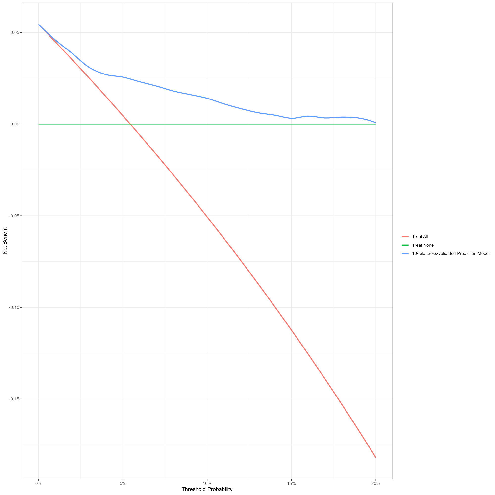

## CGP検査に対するDecision curve analysisについて考えたこと
[Decision curve analysis](https://en.wikipedia.org/wiki/Decision_curve_analysis)は、結果を予測するアルゴリズムの有用性を評価する一つの手法として開発されました。
そのR言語をはじめとしたプログラミング言語での実装および理論の詳細な説明が[MSKCCからなされています](https://mskcc-epi-bio.github.io/decisioncurveanalysis/index.html)。
患者さんや主治医の意向、すなわちCGP検査がどの程度治療に結びつくのであれば検査を受けるのか、という閾値は患者さんの思想、哲学、経済状況、病状などによって異なります。
一般的なROC曲線での予測モデルの評価では、このような患者さん個々の状況を考慮することはできません。
Decision curve analysisでは、患者さんの意向が与えられた状況下で予測モデルを用いるとどの程度患者さんにメリットがあるのかを数値化することが可能です。

  
上の図はDCAの一例で、CGP検査を全症例に行った場合（赤）、全症例に行わなかった場合（緑）、ノモグラムに従って検査を行った場合（青）の患者さんのNet-benefitが表示されています。Net-benefitは「治療到達というメリットと検査を受けることのデメリットの差分」を意味しています。この例ではCGP検査を受けた場合の治療到達率が6％程度であり、赤線と緑線がThreshold Probability 6％で交差しています。これは、CGPのメリットとデメリットを94:6の比率で考えている場合には、検査を受けても受けなくても予想されるメリットの平均値は変わりない、という解釈になります。メリットが非常に大きい場合はThreshold Probabilityが0％に近づき、CGP検査を全例に行った方が良いということになりますし、一方でCGP検査のメリットが乏しく金銭的な負担、結果が出るまでの心理的負担、良い結果が出なかったときの失望などのデメリットが大きいと考えた場合、赤線はマイナスとなっており検査を行わない方が良いということになります。  

上図で青線は常に赤線・緑線よりも上に位置していますが、これはノモグラムに基づいて患者選択を行うことで、治療に結びつかない無駄な検査を減らしつつ治療に繋がる患者さんをあまり逃さないということを意味します。もしノモグラムがない場合は、患者さんのThreshold Probabilityが6％以下ならCGP検査を行い、6％以上なら検査をしないということになりますが、ノモグラムを使用すれば、Threshold Probabilityが高い状況であってもCGP検査を行うメリットがある患者さんの選択に（この図だと100人に0.5人くらいにはなりますが）繋がる場合があると考えられます。  
  
客観的指標で評価可能なCGP検査のメリットは治療到達によってもたらされる生命予後延長効果、デメリットは金銭的負担が挙げられます。もし治療到達率が10％、治療による生命予後延長効果が1年であるとすれば、CGP検査を受けることによる平均的な生命予後延長効果は0.1年とみなせます。金銭的負担はCGP検査の費用56万円のうち、自己負担が1-3割、高額医療制度を考慮すると患者さんの自己負担額は4万円〜16万円となります。0.1年の生存期間延長と自己負担額の比率をどのように考えるかでThreshold Probabilityが変動します。  
  
医療経済学で用いられる増分費用効果比（Incremental cost-effectiveness ratio: ICER）」と呼ばれる指標では、新規医療の保険適用の基準としてICERが500万円を下回るかどうかが用いられることがあります（がんの領域では適切なICERの基準がいまだ不明確です）。この観点では、仮定したパラメタにおけるCGP検査のICERは560万円となり、CGP検査は国の医療政策の観点からはやや費用対効果が低めということになります。さて、患者さんとしても1年の生存期間の価値を500万円と考えると仮定するならば、Threshold Ptobabilityは（4万円〜16万円） ÷ (500万円＋4万円〜16万円）、おおよそ1〜3％程度となり、全症例でCGP検査を受けるメリットがあるというように解釈が可能になります。  
  
### 解析の限界
C-CATに登録された患者は当然ながら全例「CGP検査を受けた」というバイアスがあります。主治医や患者さんの漠然とした選択基準に従いCGP検査が行われています。
一方で、その基準に従ってCGP検査を受けなかった患者さんの情報はC−CATから得ることはできず、畢竟新たに開発したノモグラムの外的妥当性がどの程度あるのかは不明確です。
現状のノモグラムおよびDecision curveの活用としては、「臨床的にCGP検査の適応を考慮した患者さんに本当に検査を実施すべきか判断する」というシチュエーションになろうかと思われます。  
